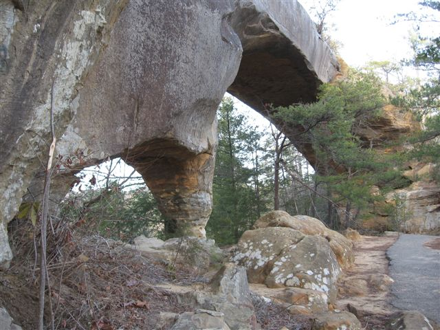

# rrg

Red River Gorge National Geological Area (Arches)

**A Base Map of Arches**

[Download a GeoPDF of Arches](basemap/rrgNewRed.pdf)

**Photos of Skybridge**

*From ToRedRiverGorge*

*From Flickr*

# Lab 7

**Skybridge Map**

**Video of Skybridge**

[Link to Video](https://youtu.be/ig3jhBgR0bk)

**Potree of Skybridge**

[Link to Potree](https://apa299.github.io/rrg/potreeSKY/)
