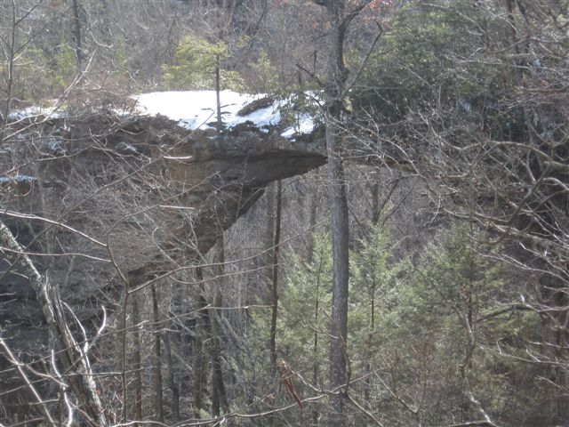
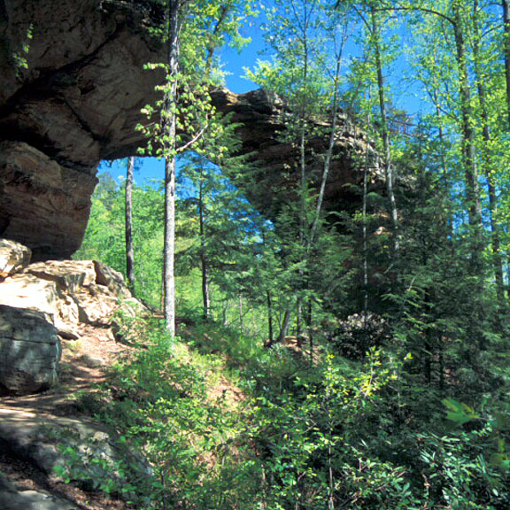
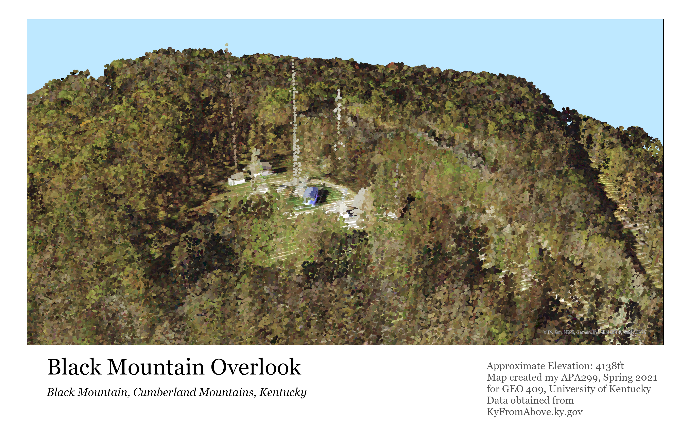
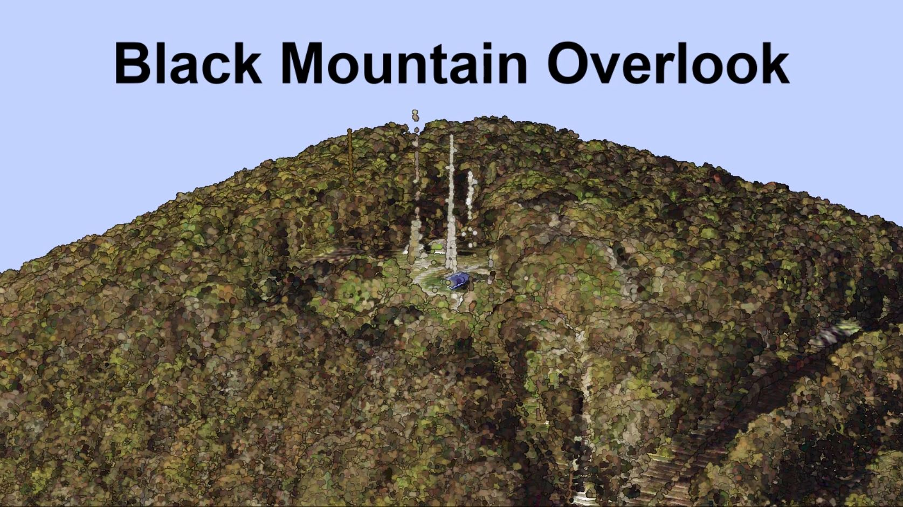
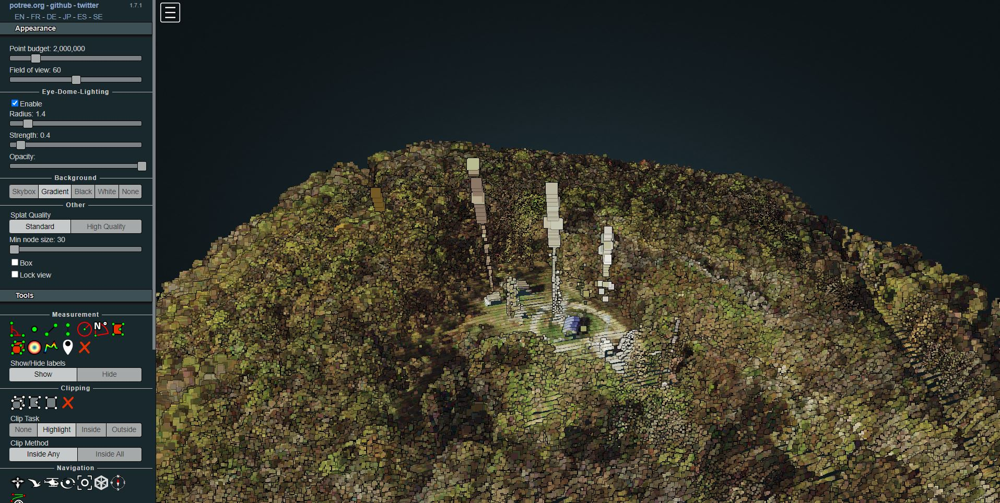

# rrg

Red River Gorge National Geological Area (Arches)

**A Base Map of Arches**

[Download a GeoPDF of Arches](basemap/rrg.pdf)

**Photos of Gray's Arch**

*From ToRedRiverGorge.com*

*From NaturalArches.org*

# Lab 7

Part 1

**Black Mountain Overlook**

Part 2

**Video of Black Mountain**

[Link to Video](https://youtu.be/J0KL63oRgEU)

**Potree of Black Mountain**

[Link to Potree](http://127.0.0.1:5500/BlackMountain/potree/)
